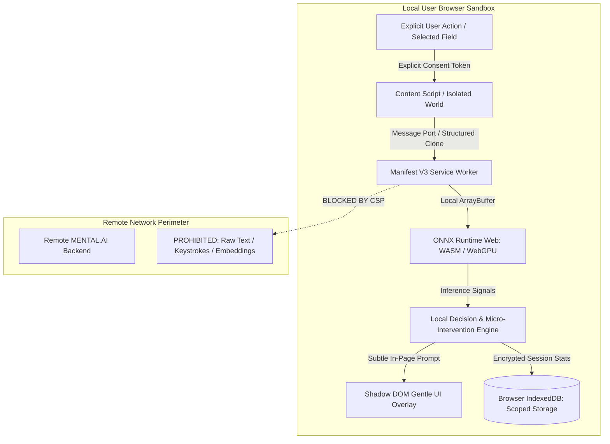

# MENTAL.AI Companion Browser Extension — Privacy-First Architectural Roadmap

**Document Version:** `1.0.0`  
**Classification:** Product & Engineering Architectural Specification  
**Core Invariant:** Zero Remote Server Egress for Raw User Text or High-Dimensional Embeddings

---

## 1. Executive Summary & Objective

The **MENTAL.AI Companion Browser Extension** is an optional, privacy-first desktop browser companion designed to bring real-time, on-device contextual emotional awareness and gentle micro-interventions to users as they compose or read text online (e.g. email, messaging platforms, social writing spaces).

Unlike conventional extensions that stream keystrokes or DOM contents to cloud APIs, the MENTAL.AI extension operates under a **strictly local-first security envelope**. All inference—from deterministic crisis safety checks to multi-label emotion recognition and contextual sentiment analysis—is executed on the user's local machine via **ONNX Runtime Web (WASM / WebGPU)**.

---

## 2. Core Architectural Principles & Invariants



### Invariant Table

| Principle | Architectural Guarantee | Enforcement Mechanism |
|---|---|---|
| **Zero Raw Egress** | Raw writing, keystrokes, and embeddings NEVER leave `localhost`. | Strict Manifest V3 `content_security_policy` prohibiting network endpoints for text. |
| **Active Consent** | The extension never monitors tabs passively or broadly. | Host permissions default to `activeTab` or user-whitelisted domains only. |
| **Client-Only Inference** | Analysis runs on local CPU / GPU using WebAssembly or WebGPU. | Bundled quantized ONNX model files served from `chrome-extension://` origin. |
| **Non-Intrusive UX** | No blocking modals, alarms, or intrusive popups for routine states. | Isolated Shadow DOM pills with micro-interventions (e.g., breath pacing). |
| **Immediate Crisis Handling** | Suicidal crisis cues trigger immediate, local access to 988 resources. | Authoritative deterministic safety engine built directly into local runtime. |

---

## 3. Permission Boundary & Manifest V3 Security Model

The extension is architected specifically for **Manifest V3** with the absolute minimum permission surface required:

### `manifest.json` Specification

```json
{
  "manifest_version": 3,
  "name": "MENTAL.AI Companion — Private Contextual Support",
  "version": "1.0.0",
  "description": "On-device emotional awareness, gentle micro-interventions, and crisis protection. Zero data leaves your device.",
  "permissions": [
    "storage",
    "activeTab"
  ],
  "optional_permissions": [
    "scripting"
  ],
  "host_permissions": [],
  "background": {
    "service_worker": "background.js",
    "type": "module"
  },
  "action": {
    "default_popup": "popup.html",
    "default_icon": {
      "16": "icons/icon-16.png",
      "48": "icons/icon-48.png",
      "128": "icons/icon-128.png"
    }
  },
  "content_security_policy": {
    "extension_pages": "script-src 'self' 'wasm-unsafe-eval'; object-src 'self'; connect-src 'none';"
  },
  "web_accessible_resources": [
    {
      "resources": [
        "models/minilm-l6-v2-int8.onnx",
        "models/vocab.json",
        "ort-wasm-simd-threaded.wasm"
      ],
      "matches": ["<all_urls>"]
    }
  ]
}
```

### Key Security Guardrails:
1. **`connect-src 'none'`**: The extension runtime is cryptographically and mechanically prevented by the browser CSP from establishing outbound HTTP, WebSocket, or Fetch connections. Network transmission is physically impossible under this policy.
2. **`activeTab` only**: Host permissions are NOT declared broadly (`<all_urls>` is excluded from permissions). Content scripts run only when the user explicitly triggers the extension or enables a specific origin in their trusted sites list.
3. **`wasm-unsafe-eval`**: Confined solely to extension background pages for high-throughput ONNX Runtime Web WebAssembly SIMD execution.

---

## 4. On-Device Intelligence Architecture

### 4.1 Tiered Local Pipeline

The companion extension implements a 3-tier local pipeline to minimize CPU/battery overhead:

1. **Tier 1 — Deterministic Rule & Invariant Filter (< 2 ms):**
   - High-speed lexical regex filter checking for crisis invariants (e.g., tenth-floor jumping rule, intentional self-harm keywords, immediate plan markers).
   - Instant triage: If an acute crisis indicator is detected, bypass contextual models and immediately present local crisis resources (e.g., US/Canada 988, UK 111, EU 112).
2. **Tier 2 — Lexical Emotion & Sentiment Screen (< 5 ms):**
   - Multi-label emotional cue analyzer detecting sadness, loneliness, anger, fear, anxiety, frustration, happiness, and uncertainty.
   - Evaluates third-person versus first-person context and temporal markers.
3. **Tier 3 — Quantized Contextual Encoder (ONNX Web / MiniLM INT8, ~40 ms):**
   - Triggered only after user finishes typing (debounced at 1200ms) or upon explicit user request.
   - Embeds text into dense 384-dimensional space on-device via WebAssembly SIMD or WebGPU.
   - Disentangles sarcasm, idioms, and negation without sending data over the network.

### 4.2 Resource Budget & Cold Start

- **Model Footprint:** 22.9 MB (INT8 quantized `all-MiniLM-L6-v2` ONNX graph).
- **WASM Binary:** 4.2 MB (`ort-wasm-simd.wasm`).
- **Memory Overhead:** < 45 MB RSS in background service worker.
- **Warm Inference Latency:** ~25 ms on modern laptop CPUs; < 10 ms with WebGPU.

---

## 5. Micro-Intervention UX & Clinical Boundaries

### 5.1 Subtle, Empathetic Interventions

The extension does not judge or diagnose. It provides gentle, restorative pauses when sustained agitation or distress is observed:

- **The Gentle Pause (Micro-Intervention 1):**
  - *Trigger:* Rapid typing accompanied by high anger or frustration cues over > 100 words.
  - *Presentation:* A subtle, floating pill near the editor: *"Take a breath before hitting send?"* Clicking expands a 5-second box-breathing animation.
- **Grounding Reflection (Micro-Intervention 2):**
  - *Trigger:* Repeated self-reported loneliness or overwhelm cues.
  - *Presentation:* *"Carrying a lot right now. Would you like to save this draft and take a 2-minute break?"*
- **Crisis Lifebuoy (Tier 1 Invariant):**
  - *Trigger:* Explicit crisis or self-harm signals.
  - *Presentation:* Clear, non-dismissible yet calm resource card:
    > **You don't have to carry this alone.**
    > Free, confidential support is available right now:
    > - **Call or text 988** (Suicide & Crisis Lifeline — US & Canada)
    > - **Text HOME to 741741** (Crisis Text Line)
    > - **Call 112** (European Emergency Services)

### 5.2 Clinical Non-Diagnostic Boundary

All extension interfaces must prominently display the standard safety invariant:
> *"MENTAL.AI provides personal writing reflections and mindfulness cues, not clinical or psychiatric diagnoses. It is not a healthcare provider."*

---

## 6. Implementation Milestones & Roadmap

| Phase | Milestone | Deliverables | Target Completion |
|---|---|---|---|
| **M1** | Extension Scaffold & Sandbox | Manifest V3 project structure, Webpack/Vite build pipeline, Shadow DOM UI injection. | Q1 2027 |
| **M2** | On-Device Deterministic Safety | Porting of `onDeviceInference.ts` safety engine into background service worker with zero network CSP. | Q2 2027 |
| **M3** | ONNX Runtime Web WASM Pipeline | Bundling quantized MiniLM INT8 model, local tokenization in JS, WebAssembly SIMD verification. | Q3 2027 |
| **M4** | Micro-Intervention UX & Consent Settings | Shadow DOM breath-pacing widget, domain whitelist manager, local IndexedDB export/clear tooling. | Q4 2027 |
| **M5** | Independent Privacy & Security Audit | External penetration test verifying `connect-src 'none'`, zero packet egress, and DOM isolation. | Q1 2028 |

---

## 7. Edge Cases & Defensive Engineering

1. **Password and Sensitive Input Fields:**
   - Content scripts explicitly ignore `input[type="password"]`, `input[autocomplete*="cc-"]`, and any DOM elements tagged with `data-private` or `aria-hidden="true"`.
2. **Third-Person Disclosures:**
   - If user writes about a friend or family member in distress, the intervention gently routes to ally guidance: *"Supporting someone in pain can be exhausting. Here are ways to connect them with help while caring for yourself."*
3. **Offline / Flight Mode Execution:**
   - Because all models and assets reside within the extension's unpacked bundle, 100% of features function seamlessly offline with zero connectivity.
